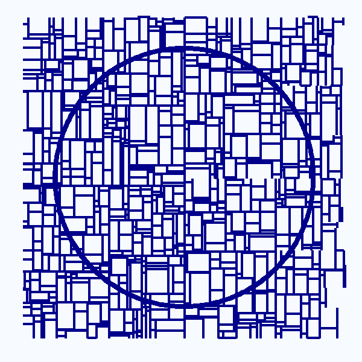

```{r, include=FALSE}
knitr::opts_chunk$set(
  results='asis', 
  echo = FALSE
)

library(magrittr) # For the pipe
source("cv_printing_functions.r")

# Read in all data and initialize a CV printer object
CV <- create_CV_object(
  data_location = "C:/Users/tim/Documents/CV/data/",  
  pdf_mode = params$pdf_mode
)

```


```{r}
# When in pdf export mode the little dots are unaligned, so fix that with some conditional CSS.
if(params$pdf_mode) {
    cat("
<style>
:root{
  --decorator-outer-offset-left: -6.5px;
}
</style>")
}
```


Aside
================================================================================

<!-- {width=100%} -->

Contact {#contact}
--------------------------------------------------------------------------------
<!-- For more icons, see: https://fontawesome.com/icons?from=io -->

- <i class="fa fa-home"></i> Minneapolis, MN
- <i class="fa fa-phone"></i> 612 438 8830
- <i class="fa fa-envelope"></i> timschoof@gmail.com
- <i class="fa fa-link"></i> [timschoof.com](https://www.timschoof.com/)
- <i class="fa fa-github"></i> [timscho](github.com/timschoof)
- <i class="fab fa-linkedin-in"></i> [tim-schoof-821a10113](https://www.linkedin.com/in/tim-schoof-821a10113/)

Skills {#skills}
--------------------------------------------------------------------------------

- R
- tidyverse
- MATLAB
- Git and GitHub
- SQL


```{r}
CV %<>% print_text_block('notes_a')
```


Main
================================================================================

Tim Schoof, PhD {#title}
--------------------------------------------------------------------------------

<!-- ```{r} -->
<!-- # Note the special double pipe so we modify the CV object in place -->
<!-- CV %<>% print_text_block("intro")  -->
<!-- ``` -->

Experience {data-icon=laptop}
--------------------------------------------------------------------------------

```{r}
CV %<>% print_section('experience')
```


Education {data-icon=graduation-cap}
--------------------------------------------------------------------------------

```{r}
CV %<>% print_section('education')
```

::: aside

```{r}
CV %<>% print_text_block('notes_b')
```

:::


Relevant presentations  {data-icon=chalkboard}
--------------------------------------------------------------------------------

```{r}
CV %<>% print_section('presentations')
```

::: aside
```{r}
CV %<>% print_text_block('presentations_aside')
```
:::

Data Science Writing  {data-icon=laptop}
--------------------------------------------------------------------------------

```{r}
CV %<>% print_section('data_science_writing')
```

Selected publications {data-icon=book}
--------------------------------------------------------------------------------

```{r}
CV %<>% print_section('academic_articles')
```

Patents  {data-icon=newspaper}
--------------------------------------------------------------------------------

```{r}
CV %<>% print_section('patents')
```


::: aside
Made with [pagedown](https://pagedown.rbind.io/) and [datadrivencv](https://github.com/nstrayer/datadrivencv).

Source code is available at [ github.com/timschoof/CV](https://github.com/timschoof/CV)

Last updated on `r format(Sys.time(), format = "%m-%d-%Y")`

:::
